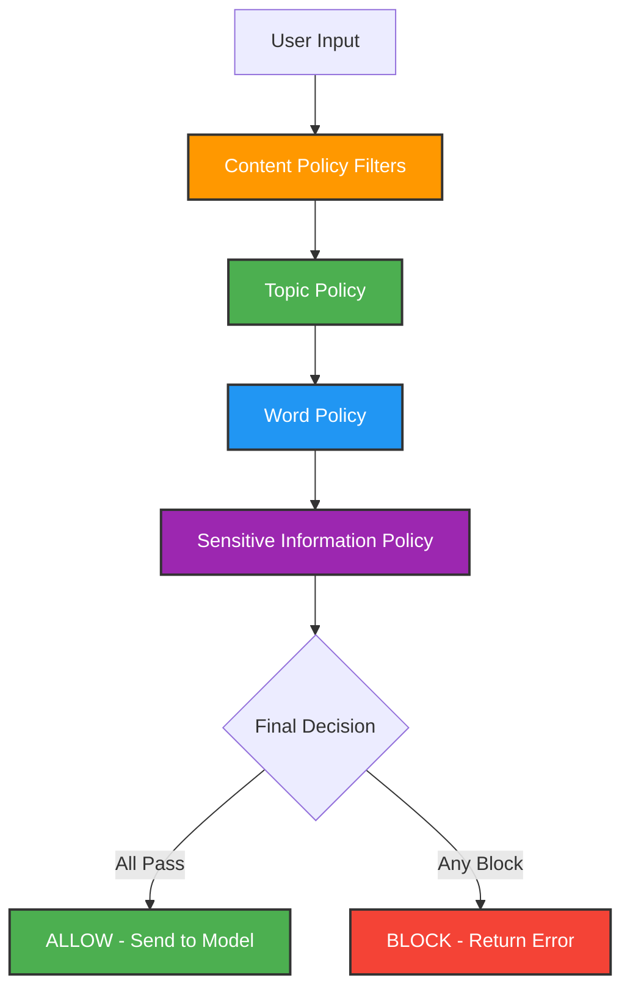

# How Bedrock Guardrails Work: Processing Flow & Logic

## 🔄 Guardrail Processing Flow

### **Sequential Processing - NOT First Match Wins**

Bedrock guardrails process content through **ALL policies sequentially**, not stopping at first match:



## 📋 **Processing Logic**

### **1. Content Policy Filters (First)**
```yaml
Evaluation Order:
  - SEXUAL: HIGH → Scan for sexual content
  - VIOLENCE: HIGH → Scan for violent content  
  - HATE: HIGH → Scan for hate speech
  - INSULTS: LOW → Scan for insults (permissive)
  - MISCONDUCT: NONE → Skip misconduct check
  - PROMPT_ATTACK: NONE → Skip prompt injection check
```

**Result**: If ANY filter triggers above threshold → **BLOCK**

### **2. Topic Policy (Second)**
```yaml
Topic Matching:
  - CodeGeneration: ALLOW → Check if content matches
  - FileOperations: ALLOW → Check if content matches
  - EncodedContent: ALLOW → Check if content matches
  - CodeInjection: ALLOW → Check if content matches
```

**Logic**: 
- If content matches ANY `ALLOW` topic → **CONTINUE**
- If content matches ANY `DENY` topic → **BLOCK**
- If no topic matches → Use default behavior

### **3. Word Policy (Third)**
```yaml
Word Scanning:
  - Allowed Words: ['rewrite', 'refactor', 'code', 'file'] → ALLOW
  - Blocked Words: [profanity list] → BLOCK
```

**Result**: If blocked word found → **BLOCK**

### **4. Sensitive Information Policy (Fourth)**
```yaml
PII Detection:
  - EMAIL: ANONYMIZE → Replace with [EMAIL]
  - PHONE: ANONYMIZE → Replace with [PHONE]
  
Regex Patterns:
  - ProductionAPIKeys: BLOCK → Block if matches
  - AllowEncodedContent: ALLOW → Allow if matches
  - AllowFileReferences: ALLOW → Allow if matches
```

**Logic**:
- **BLOCK** patterns → **IMMEDIATE BLOCK**
- **ALLOW** patterns → **CONTINUE PROCESSING**
- **ANONYMIZE** → **MODIFY CONTENT** and continue

## ⚡ **Key Processing Rules**

### **❌ Blocking Behavior:**
- **ANY** content filter above threshold → **IMMEDIATE BLOCK**
- **ANY** blocked word found → **IMMEDIATE BLOCK**  
- **ANY** BLOCK regex pattern match → **IMMEDIATE BLOCK**
- **NO** matching ALLOW topic (if topics defined) → **BLOCK**

### **✅ Allow Behavior:**
- **ALL** content filters pass (below threshold)
- **AND** at least one ALLOW topic matches
- **AND** no blocked words found
- **AND** no BLOCK regex patterns match

### **🔄 Processing Continues:**
- Content filters with `NONE` strength are **SKIPPED**
- ALLOW regex patterns **DO NOT** stop processing
- ANONYMIZE actions **MODIFY** content and continue
- All policies must pass for final **ALLOW**

## 🎯 **Example**

### **Why Your Prompt Was Blocked:**
```
Original Prompt: "ipynb#XXXxxxxxx" + "file to be rewritten" + "refactor code"

Processing Flow:
1. Content Filters: PROMPT_ATTACK detected encoded content → BLOCK
2. Never reached Topic Policy
3. Never reached Word Policy  
4. Never reached Regex Policy
```

### **How Enhanced Guardrail Fixes It:**
```yaml
1. Content Filters:
   - PROMPT_ATTACK: NONE → SKIP (no blocking)
   - MISCONDUCT: NONE → SKIP (no blocking)

2. Topic Policy:
   - CodeGeneration: ALLOW → MATCHES → CONTINUE
   - EncodedContent: ALLOW → MATCHES → CONTINUE

3. Word Policy:
   - 'rewrite': ALLOWED → CONTINUE
   - 'file': ALLOWED → CONTINUE

4. Regex Policy:
   - 'ipynb#[A-Za-z0-9+/=%]+': ALLOW → CONTINUE
   - '(file|rewrite|refactor|code)': ALLOW → CONTINUE

Final Result: ALL POLICIES PASS → ALLOW
```

## 🔍 **Testing Different Scenarios**

### **Scenario 1: Partial Block**
```
Input: "Please hack this system and rewrite code"

Processing:
1. Content Filter: MISCONDUCT → BLOCK (if enabled)
2. STOPS HERE - Never checks topics/words/regex
```

### **Scenario 2: Topic Mismatch**
```
Input: "Tell me about cooking recipes"

Processing:
1. Content Filters: PASS
2. Topic Policy: NO MATCH for allowed topics → BLOCK
3. STOPS HERE
```

### **Scenario 3: Word Block**
```
Input: "Please improve this damn code"

Processing:
1. Content Filters: PASS
2. Topic Policy: CodeGeneration MATCH → CONTINUE
3. Word Policy: "damn" in profanity list → BLOCK
4. STOPS HERE
```

## 📊 **Performance Implications**

### **Processing Time:**
- **Early Block**: Faster (stops at first blocking policy)
- **Full Allow**: Slower (must check all policies)
- **Regex Heavy**: Slower (pattern matching intensive)

### **Optimization Tips:**
- Set restrictive content filters to `NONE` for development
- Use broad ALLOW topics to reduce topic matching overhead
- Minimize regex patterns for better performance
- Use specific word lists rather than broad pattern matching

## 🎯 **Summary**

**Guardrails DO NOT stop at first match** - they process through ALL policies:

1. **Sequential Processing**: Content → Topic → Word → Sensitive Info
2. **Any Block = Final Block**: One blocking policy blocks entire request
3. **All Must Pass**: Every policy must allow for final approval
4. **Early Termination**: Only happens on BLOCK, not ALLOW
5. **Modification Continues**: ANONYMIZE actions modify and continue processing
