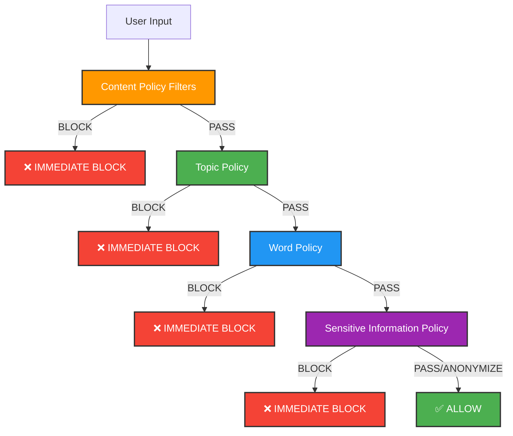

# How Bedrock Guardrails Work: Processing Flow & Logic

## 🔄 Guardrail Processing Flow

### **Sequential Processing with Early Termination on BLOCK**

Bedrock guardrails process content sequentially and **STOP IMMEDIATELY** when any policy blocks:



## 📋 **Processing Logic**

### **1. Content Policy Filters (First)**
```yaml
Evaluation Order:
  - SEXUAL: HIGH → Scan for sexual content
  - VIOLENCE: HIGH → Scan for violent content  
  - HATE: HIGH → Scan for hate speech
  - INSULTS: LOW → Scan for insults (permissive)
  - MISCONDUCT: NONE → Skip misconduct check
  - PROMPT_ATTACK: NONE → Skip prompt injection check
```

**Result**: If ANY filter triggers above threshold → **BLOCK**

### **2. Topic Policy (Second)**
```yaml
Topic Matching:
  - MaliciousHacking: DENY → Check if content matches
  - IllegalActivities: DENY → Check if content matches
  - ChildExploitation: DENY → Check if content matches
  - Terrorism: DENY → Check if content matches
```

**Logic**: 
- If content matches ANY `DENY` topic → **BLOCK**
- If no DENY topic matches → **ALLOW** (continue processing)
- **Note**: There are NO `ALLOW` topics - only `DENY` topics

### **3. Word Policy (Third)**
```yaml
Word Scanning:
  - Words in WordsConfig: [blocked words] → BLOCK
  - Words NOT in WordsConfig: [all other words] → ALLOW
  - ManagedWordListsConfig: [profanity list] → BLOCK
```

**Result**: If blocked word found → **BLOCK**
**Note**: There is NO "allowed words" list - only blocked words

### **4. Sensitive Information Policy (Fourth)**
```yaml
PII Detection:
  - EMAIL: ANONYMIZE → Replace with [EMAIL]
  - PHONE: ANONYMIZE → Replace with [PHONE]
  
Regex Patterns:
  - ProductionAPIKeys: BLOCK → Block if matches
  - MaliciousFileDownloads: BLOCK → Block if matches
  - SuspiciousDownloadCommands: BLOCK → Block if matches
```

**Logic**:
- **BLOCK** patterns → **IMMEDIATE BLOCK**
- **ANONYMIZE** → **MODIFY CONTENT** and continue
- **No pattern match** → **ALLOW** (continue processing)
- **Note**: There are NO `ALLOW` regex patterns - only `BLOCK` and `ANONYMIZE`

## ⚡ **Key Processing Rules**

### **❌ Blocking Behavior:**
- **ANY** content filter above threshold → **IMMEDIATE BLOCK**
- **ANY** blocked word found → **IMMEDIATE BLOCK**  
- **ANY** BLOCK regex pattern match → **IMMEDIATE BLOCK**
- **ANY** matching DENY topic → **BLOCK**

### **✅ Allow Behavior:**
- **ALL** content filters pass (below threshold)
- **AND** no DENY topics match
- **AND** no blocked words found
- **AND** no BLOCK regex patterns match
- **AND** no PII requiring ANONYMIZE

### **🔄 Processing Rules:**
- Content filters with `NONE` strength are **SKIPPED**
- **EARLY TERMINATION**: Processing stops immediately on ANY BLOCK
- **ANONYMIZE EXCEPTION**: Only ANONYMIZE actions modify content and continue
- **ALL MUST PASS**: Every policy must allow for final approval

## 🎯 **Your Specific Case**

### **Why Your Prompt Was Blocked:**
```
Original Prompt: "ipynblk0sCvlsOP%3D%4D" + "file to be rewritten" + "refactor code"

Processing Flow:
1. Content Filters: PROMPT_ATTACK detected encoded content → BLOCK
2. Never reached Topic Policy
3. Never reached Word Policy  
4. Never reached Regex Policy
```

### **How Enhanced Guardrail Fixes It:**
```yaml
1. Content Filters:
   - PROMPT_ATTACK: NONE → SKIP (no blocking)
   - MISCONDUCT: NONE → SKIP (no blocking)

2. Topic Policy:
   - No DENY topics match → CONTINUE
   - Content allowed by default → CONTINUE

3. Word Policy:
   - 'rewrite': NOT in blocked list → CONTINUE
   - 'file': NOT in blocked list → CONTINUE

4. Regex Policy:
   - No BLOCK patterns match → CONTINUE
   - Encoded content allowed by default → CONTINUE

Final Result: ALL POLICIES PASS → ALLOW
```

## 🔍 **Testing Different Scenarios**

### **Scenario 1: Early Block (Most Common)**
```
Input: "Please hack this system and rewrite code"

Processing:
1. Content Filter: MISCONDUCT=HIGH → BLOCK
2. STOPS HERE - Never reaches Topic/Word/Regex policies
3. Result: BLOCKED
```

### **Scenario 2: Sequential Until Block**
```
Input: "Please improve this damn code"

Processing:
1. Content Filters: PASS
2. Topic Policy: PASS
3. Word Policy: "damn" in profanity list → BLOCK
4. STOPS HERE - Never reaches Sensitive Info policy
5. Result: BLOCKED
```

### **Scenario 3: Full Processing (All Pass)**
```
Input: "Please improve this Python code"

Processing:
1. Content Filters: PASS
2. Topic Policy: PASS
3. Word Policy: PASS
4. Sensitive Info: PASS
5. Result: ALLOWED
```

## 📊 **Performance Implications**

### **Processing Time:**
- **Early Block**: Faster (stops at first blocking policy)
- **Full Allow**: Slower (must check all policies)
- **Regex Heavy**: Slower (pattern matching intensive)

### **Optimization Tips:**
- Set restrictive content filters to `NONE` for development
- Use broad ALLOW topics to reduce topic matching overhead
- Minimize regex patterns for better performance
- Use specific word lists rather than broad pattern matching

## 🎯 **Summary**

**Guardrails DO stop at first blocking match** - they use early termination:

1. **Sequential Processing**: Content → Topic → Word → Sensitive Info
2. **Early Termination**: Processing stops immediately on ANY BLOCK
3. **Any Block = Final Block**: One blocking policy blocks entire request
4. **All Must Pass**: Every policy must allow for final approval
5. **ANONYMIZE Exception**: Only ANONYMIZE actions modify and continue processing

